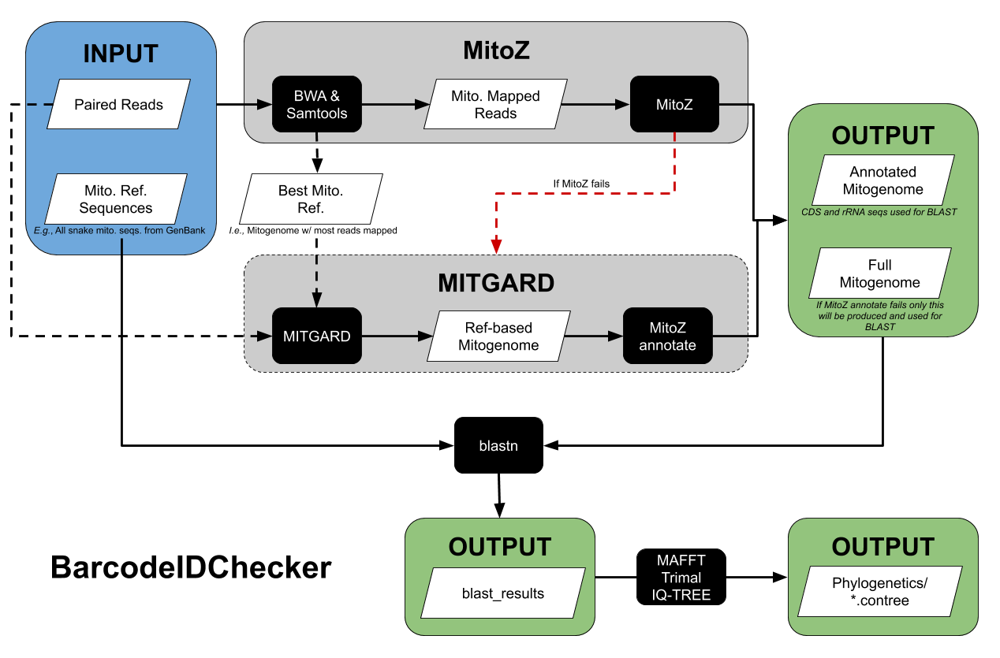

# BarcodeIDChecker
#### Rhett M. Rautsaw

This script is a wrapper for [MitoZ](https://github.com/linzhi2013/MitoZ) and [MITGARD](https://github.com/pedronachtigall/MITGARD) and is designed extract vertebrate mitochondrial genomes from raw or trimmed sequencing data. It will then blast the resulting mitogenome or barcoding genes (e.g., CYTB, COX1, ND4, 16S, etc.) to check for sample mislabeling.


## Arguments

- **-f1, --fastq1**
	- REQUIRED: Full path to fastq read pair 1 (forward)
- **-f2, --fastq2**
	- REQUIRED: Full path to fastq read pair 2 (reverse)
- **-r, --reference**
	- REQUIRED: Full path to fasta reference database
	- I recommend downloading any and all mitochondrial sequences/genomes for your clade from [GenBank](https://www.ncbi.nlm.nih.gov/genbank/) to function as your reference.
	- For example, since I study pitvipers I would download all mitochondrial sequences for snakes.
- **-o, --output**
	- OPTIONAL: Prefix for output files. Default is `ZZZ`
- **-t, --num_threads**
	- OPTIONAL: Number of threads. Default is 8


## Pipeline

1. Map fastq reads to reference fasta using bwa
2. Keep reads that successfully mapped using samtools
3. Assemble mitogenome using MitoZ
	- If MitoZ fails, identify the best reference sequence and use MITGARD
4. Extract protein coding/barcoding genes
5. Blast mitogenome or genes to reference fasta and determine top blast hit for taxa ID




## Installation
**System Requirement**

- Linux

**Dependencies**

```
conda create -n mitgard_env \
biopython=1.69 \
blast=2.2.31 \
bowtie2=2.3.5 \
bwa=0.7.12 \
circos=0.69 \
ete3=3.0.0b35 \
gnu-parallel \
hmmer=3.1b2 \
infernal=1.1.1 \
libgd=2.2.4 \
minimap2=2.17 \
openjdk \
perl-bioperl \
perl-clone \
perl-list-moreutils \
perl-params-validate \
python=3.6.0 \
samtools=1.9 \
spades=3.13.1 \
tbl2asn \
trinity=2.8.5

git clone https://github.com/pedronachtigall/MITGARD.git
echo 'export PATH="$PATH:path/to/MITGARD/bin/"' >> ~/.bash_profile

git clone https://github.com/linzhi2013/MitoZ.git
tar -jxvf MitoZ/version_2.4-alpha/release_MitoZ_v2.4-alpha.tar.bz2
echo 'export PATH="$PATH:path/to/release_MitoZ_v2.4-alpha/"' >> ~/.bash_profile


conda activate mitgard_env

python3
from ete3 import NCBITaxa
ncbi = NCBITaxa()
ncbi.update_taxonomy_database()
quit()
```


## Example
```
BarcodeIDChecker.py -f1 {}_F.fq -f2 {}_R.fq -r mito_ref.fasta -o {}
```


**Example PBS Script**
```
#PBS -N BarcodeIDChecker
#PBS -l select=20:ncpus=16:mem=100gb,walltime=72:00:00

source .bash_profile

module load anaconda3
source activate mitgard_env

cd $PBS_O_WORKDIR

bwa index mito_ref.fasta
makeblastdb -in mito_ref.fasta -dbtype nucl

parallel -a samples.txt --sshloginfile $PBS_NODEFILE -j1 "source .bash_profile
	module load anaconda3
	source activate mitgard_env
	cd /path/to/workdir
	mkdir {}
	cd {}
	BarcodeIDChecker.py -r /path/to/mito_ref.fasta \
	-f1 /path/to/workdir/{}/02_trimmed/{}_F.fq.gz \
	-f2 /path/to/workdir/{}/02_trimmed/{}_R.fq.gz \
	-o {} -t 16"
```

## Output
Inside the `BarcodeIDChecker_results` folder, you will find a tab-delimited file with the top 10 results for each successfully annotated mitochondrial gene for you to check your species ID including percent identity.

- `{}_blast.tab`

In addition, you will also find a `{}.result` folder that contains:

- The mitogenome `{}.fasta`
- The cds regions `{}.cds`
- A mitogenome plot `{}.circos.*`
- A genbank file `{}.mitoscaf.fa.gbf`

If `MitoZ` failed and `MITGARD` was required, you will also find the `best_reference.*` files which identify what reference sequence was used to create the mitogenome. The `{}_F.fq` and `{}_R.fq` files are the fastq reads which mapped to the provided reference sequences via `bwa`.


## Cite
- https://github.com/reptilerhett/BarcodeIDChecker
- [MitoZ](https://github.com/linzhi2013/MitoZ)
- [MITGARD](https://github.com/pedronachtigall/MITGARD)
- [BWA](http://bio-bwa.sourceforge.net/)
- [Samtools](http://www.htslib.org/)
