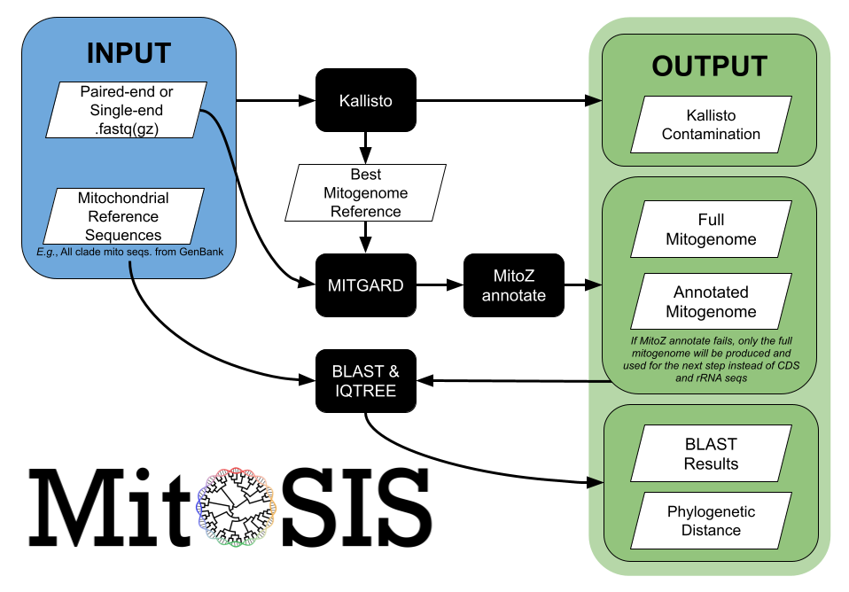

## Rhett M. Rautsaw & Pedro Nachtigall 

 `MitoSIS` (Mitochondrial Species Identification System) is a wrapper for mitochondrial genome assembly and identification of sample contamination or mislabeling. Specifically, `MitoSIS` maps raw or trimmed reads to a database of reference mitochondrial sequences. It calculates the percentage of reads that map to different species using [`Kallisto`](https://pachterlab.github.io/kallisto/) to assess potential sample contamination. It then uses [`MitoZ`](https://github.com/linzhi2013/MitoZ) and [`MITGARD`](https://github.com/pedronachtigall/MITGARD) to assemble and annotate the full mitochondrial genome and BLASTs the resulting mitogenome or barcoding genes (*e.g.*, CYTB, COX1, ND4, 16S, etc.) to check for sample mislabeling. Finally, `MitoSIS` uses a `MAFFT` and [`IQ-TREE`](http://www.iqtree.org/) to calculate alignment distance and infer a phylogeny.

# Pipeline

1. Map fastq reads to reference using `bwa` and `kallisto`
2. Keep reads that successfully mapped
3. Assemble mitogenome using `MitoZ`
4. If `MitoZ` fails, identify the best reference sequence
	- 4.1 Use `MITGARD` to assemble mitogenome
	- 4.2 Use `MitoZ` to annotate mitogenome
5. Extract protein coding/barcoding genes
6. Blast mitogenome or genes to reference database
7. Export results and sequences
8. Align sequences and build phylogeny 



# Arguments

|       flag      |   description   |
|-----------------|-----------------|
| -h, --help      | Show this help message and exit. | 
| -f1, --fastq1   | fastq read pair 1 (forward). **Default: None** |
| -f2, --fastq2   | fastq read pair 2 (reverse). **Default: None** |
| -s, --single    | single-end fastq. **Default: None** |
| -r, --reference | `genbank` *OR* `fasta+sp` database **Default: None** <br> See section below on fasta & custom databases <br> *Recommend downloading all mitochondrial data for your clade of interest <br> e.g., snakes; [Genbank Example](https://www.ncbi.nlm.nih.gov/nuccore/?term=snakes%5Bporgn%5D+AND+mitochondrion%5Bfilter%5D) <br> Send to > Complete Record > Genbank* |
| -o, --output    | Prefix for output files. **Default: 'ZZZ'** |
| -c, --cpu       | Number of threads to be used in each step. **Default: 8** |
| -M, --memory    | Max memory for Trinity (see [Trinity](https://github.com/trinityrnaseq/trinityrnaseq/wiki/Running-Trinity) for format). **Default: '30G'** |
| --clade         | Clade used for MitoZ. Options: 'Chordata' or 'Arthropoda'. **Default: 'Chordata'** |
| --convert       | Only perform Genbank to Fasta conversion and create a tab-delimited taxa id file     |
| --version       | Show program's version number and exit |
| ||

## Fasta & Custom Reference Databases
Fasta reference databases must be accompanied by a tab-delimited taxa id (`.sp`) file. We refer to this combination of files as a `fasta+sp` database. The tab-delimited taxa id (`.sp`) file must occur in the same directory as the fasta file and have the same filename with `.sp` appended (*i.e.*, ReferenceDB.fasta and ReferenceDB.fasta.sp).

If you have a Genbank database and only want to add additional or custom sequences, we recommend first running `--convert`. 

```
MitoSIS.py -r ReferenceDB.gb --convert
```

`--convert` will convert your Genbank file to a `fasta+sp` database without running the rest of MitoSIS. Output will be:

- `ReferenceDB.fasta`
- `ReferenceDB.fasta.sp`

With the initial `fasta+sp` database created...

Manually add your additional or custom sequences to the fasta and the identifer/taxa information to the `.sp` file. 

### `fasta+sp` Format
Each fasta sequences must have unique identifiers (similar to Genbank Accession Numbers) and those identifiers must match in the tab-delimited taxa id file. Ensure to not have descriptions in the fasta header (i.e., no spaces " " in the header, only the sequence id).

{ReferenceDB}.fasta 
```
>ID_1
ACTGACTGACTGACTGACTGACTGACTGACTGACTGACTGACTG
>ID_2
ACTGACTGACTGACTGACTGACTGACTGACTGACTGACTGACTG
```

{ReferenceDB}.fasta.sp
```
ID_1    Genus species
ID_2    Genus species
```


# Installation
**System Requirement**
- Linux

**Conda Installation**
```
# Clone this Repository
git clone https://github.com/reptilerhett/MitoSIS.git
cd MitoSIS
echo "export PATH=\$PATH:$PWD" >> ~/.bash_profile

# Clone MITGARD Repository 
git clone https://github.com/pedronachtigall/MITGARD.git
# Fix shebangs in MITGARD supporting scripts
sed -i '1 s/^.*$/\#\!\/usr\/bin\/env python/' MITGARD/bin/sam2msa.py
sed -i '1 s/^.*$/\#\!\/usr\/bin\/env python/' MITGARD/bin/msa2consensus.py
echo "export PATH=\$PATH:$PWD/MITGARD/bin" >> ~/.bash_profile

# Clone MitoZ Repository
git clone https://github.com/linzhi2013/MitoZ.git
tar -jxvf MitoZ/version_2.4-alpha/release_MitoZ_v2.4-alpha.tar.bz2
echo "export PATH=\$PATH:$PWD/release_MitoZ_v2.4-alpha" >> ~/.bash_profile

# Make sure everythig has proper permissions and source your bash_profile
chmod -R 755 *
source ~/.bash_profile

# Create Conda Environment
conda env create -f mitosis_env.yml
conda activate mitosis_env

# Install dfply
pip install dfply

# Install Taxonomy Database for MitoZ
python MITGARD/install_NCBITaxa.py

# YOU'RE READY TO GO
# Check if MitoSIS.py is in your path
MitoSIS.py -h
```

# Example
Before running, we recommend testing `MitoSIS` with our [Tutorial](https://github.com/reptilerhett/MitoSIS/tree/master/Tutorial) dataset. 

We also recommend trimming your own data first prior to running this program. Example trimming using [Trim-Galore](https://github.com/FelixKrueger/TrimGalore) shown below. Depending on whether you are working with DNA or RNA-Seq data, you may want to change the length/quality parameters.
```
# Trimming
trim_galore --paired --phred33 --length 30 -q 20 -o 02_trim 00_raw/{}_F.fastq.gz 00_raw/{}_R.fastq.gz &> {}_tg.log
```

Below are outlines for running `MitoSIS`.
```
# MitoSIS - paired-end
MitoSIS.py -f1 {}_F_trim.fastq.gz -f2 {}_R_trim.fastq.gz -r ReferenceDB.gb -o {} -c 16 -M 55G &> MitoSIS.log

# MitoSIS - single
MitoSIS.py -s {}_merged.fastq.gz -r ReferenceDB.gb -o {} -c 16 -M 55G &> MitoSIS.log

# MitoSIS - paired-end & fasta+sp reference database
# NOTE: MitoSIS expects ReferenceDB.fasta.sp to occur in the same directory as ReferenceDB.fasta
MitoSIS.py -f1 {}_F_trim.fastq.gz -f2 {}_R_trim.fastq.gz -r ReferenceDB.fasta -o {} -c 16 -M 55G &> MitoSIS.log
```

# Output
```
       o O       o O       o O       o O       o O       o O
     o | | O   o | | O   o | | O   o | | O   o | | O   o | | O
   O | | | | O | | | | O | | | | O | | | | O | | | | O | | | | O
  O-oO | | o   O | | o   O | | o   O | | o   O | | o   O | | oO-o
 O---o O o       O o       O o       O o       O o       O o O---o
O-----O                                                     O-----o
o-----O         ___  ____ _        _____ _____ _____        o-----O
 o---O          |  \/  (_) |      /  ___|_   _/  ___|        o---O 
  o-O           | .  . |_| |_ ___ \ `--.  | | \ `--.          o-O
   O            | |\/| | | __/ _ \ `--. \ | |  `--. \          O
  O-o           | |  | | | || (_) /\__/ /_| |_/\__/ /         O-O
 O---o          \_|  |_/_|\__\___/\____/ \___/\____/         O---o
O-----o                                                     O-----o
o-----O                                                     o-----O
 o---O o O       o O       o O       o O       o O       o O o---O
  o-Oo | | O   o | | O   o | | O   o | | O   o | | O   o | | Oo-O
   O | | | | O | | | | O | | | | O | | | | O | | | | O | | | | O
     O | | o   O | | o   O | | o   O | | o   O | | o   O | | o
       O o       O o       O o       O o       O o       O o


2020-11-29 16:41:34 ::: starting MitoSIS...
	Forward Reads -> /zfs/venom/Rhett/2020_BarcodeTest/Tutorial/CON45_R1.fq.gz
	Reverse Reads -> /zfs/venom/Rhett/2020_BarcodeTest/Tutorial/CON45_R2.fq.gz
	Reference Database -> /zfs/venom/Rhett/2020_BarcodeTest/Tutorial/ReferenceDB.gb
	Output -> /zfs/venom/Rhett/2020_BarcodeTest/Tutorial/MitoSIS_results/CON45*
	Number of CPU -> 16
	Amount of memory -> 55G
	MitoZ Clade -> Chordata


2020-11-29 16:41:34 ::: Converting Genbank to Fasta :::


2020-11-29 16:41:34 ::: Converted 521 Genbank records to Fasta :::


2020-11-29 16:41:34 ::: Running kallisto index :::


2020-11-29 16:41:34 ::: Running kallisto :::


2020-11-29 16:41:34 ::: Summarizing kallisto to assess potential contamination :::

                species  read_count         tpm  read_percent  tpm_percent
    Crotalus adamanteus      3389.0  850947.699        85.044       85.095
 Agkistrodon piscivorus       398.0   99625.600         9.987        9.963
      Crotalus horridus       198.0   49427.400         4.969        4.943

2020-11-29 16:41:34 ::: Running bwa index :::


2020-11-29 16:41:35 ::: Running bwa mem :::


2020-11-29 16:41:35 ::: Sorting/converting sam files :::


2020-11-29 16:41:35 ::: Converting bam to fastq :::


2020-11-29 16:41:35 ::: Running MitoZ assembly :::


2020-11-29 16:41:36 ::: MitoZ failed, trying MITGARD :::


2020-11-29 16:41:36 ::: Identifying best reference sequence :::

                           sseqid  length  read_count                 species
 Selected Reference > NC_041524.1   17242     1693.75     Crotalus adamanteus
                       MH626511.1   17242     1693.75     Crotalus adamanteus
                      NC_009768.1   17213      199.00  Agkistrodon piscivorus
                       DQ523161.1   17213      199.00  Agkistrodon piscivorus
                       HM641837.1   17260       99.00       Crotalus horridus
                      NC_014400.1   17260       99.00       Crotalus horridus

2020-11-29 16:41:36 ::: Running MITGARD :::


2020-11-29 16:44:07 ::: Annotating MITGARD mitogenome with MitoZ :::


2020-11-29 16:51:43 ::: Moving onto BLAST :::


2020-11-29 16:51:43 ::: Running makeblastdb :::


2020-11-29 16:51:43 ::: Running BLAST :::


2020-11-29 16:51:44 ::: Summarizing Mean Percent Identity across genes :::

                    species  Mean_Percent_Identity
        Crotalus adamanteus              99.838545
 Crotalus horridus horridus              96.175000
          Crotalus horridus              89.570667
     Agkistrodon piscivorus              84.574576

2020-11-29 16:51:45 ::: Extracting BLAST matches for Phylogenetics :::


2020-11-29 16:51:45 ::: Aligning, Trimming, and Inferring Phylogeny for ND1.fasta :::

                                   , NC_009768.1_Agkistrodon_piscivorus_mi...
  _________________________________|
 |                                 | DQ523161.1_Agkistrodon_piscivorus_mit...
 |
 |                            , NC_041524.1_Crotalus_adamanteus_mitoc...
 |                            |
 |                            | CON45_CON45_ND1_len_981__2537_3517____
_|                            |
 |                            | GBEX01002025.1_TSA__Crotalus_adamante...
 |                            |
 |            ________________| MH626511.1_Crotalus_adamanteus_mitoch...
 |           |                |
 |           |                | JU175111.1_TSA__Crotalus_adamanteus_C...
 |___________|
             |                     , NC_014400.1_Crotalus_horridus_mitocho...
             |                _____|
             |               |     | HM641837.1_Crotalus_horridus_mitochon...
             |_______________|
                             , GBKC01002148.1_TSA__Crotalus_horridus...
                             |
                             | GAAZ01001454.1_TSA__Crotalus_horridus...

< ... removed output from other genes ... >

2020-11-29 16:52:59 ::: Summarizing Mean Alignment Distance across genes :::

                    species  Mean_Alignment_Distance
        Crotalus adamanteus                 0.023411
          Crotalus horridus                 0.162659
     Agkistrodon piscivorus                 0.200809
 Crotalus horridus horridus                 0.399161

2020-11-29 16:52:59 ::: Concatenating Genes and Removing Individuals with > 50% Missing :::


2020-11-29 16:53:00 ::: Running Concatenated Phylogeny :::

                                      _____ EF669477.1_Agkistrodon_piscivorus
  ___________________________________|
 |                                   |   , DQ523161.1_Agkistrodon_piscivorus
 |                                   |___|
 |                                       | NC_009768.1_Agkistrodon_piscivorus
_|
 |                                     , NC_041524.1_Crotalus_adamanteus
 |                                     |
 |               ______________________| CON45_
 |              |                      |
 |______________|                      | MH626511.1_Crotalus_adamanteus
                |
                |                         , NC_014400.1_Crotalus_horridus
                |_________________________|
                                          | HM641837.1_Crotalus_horridus


2020-11-29 16:53:02 ::: FINISHED :::

```


If `MitoZ` is successful (for original assembly or annotation after `MITGARD`), then you should expect the following output files. This includes a summary of the blast results (mean percent identity to different species), the raw blast results, the mitochondrial genome, `MitoZ` annotation results, and phylogenies for each gene. The log file (or STDOUT if log file not saved) will print each phylogeny. 
```
MitoSIS.log
MitoSIS_results/
├── alignment_summary.tsv
├── blast_query.fasta
├── blast_summary.tsv
├── blast_results.tsv
├── kallisto_contamination.tsv
├── {}_mitogenome.fasta
├── mitoz_most_related_species.txt
├── mitoz.result
│   ├── {}.cds
│   ├── {}.circos.dep
│   ├── {}.circos.karyotype.txt
│   ├── {}.circos.png
│   ├── {}.circos.svg
│   ├── {}.errorsummary.val
│   ├── {}.fasta
│   ├── {}.misc_feature
│   ├── {}_mitoscaf.fa.gbf
│   ├── {}_mitoscaf.fa.sqn
│   ├── {}_mitoscaf.fa.tbl
│   ├── {}_mitoscaf.fa.val
│   ├── {}.rrna
│   ├── {}.trna
│   ├── README.txt
│   ├── summary.txt
│   └── work<kmer>.files
└── Phylogenetics
    ├── gene.fasta
    ├── gene.fasta.aln
    ├── gene.fasta.contree
    ├── gene.fasta.iqtree
    └── gene.fasta.trim
```

If `MitoZ` fails, then you should expect the following output files. Noteably, a reference mitogenome will be chosen and export. Additionally, instead of a phylogeny for each gene you will find a single phylogeny using the full mitochondrial genome. 
```
MitoSIS.log
MitoSIS_results/
├──  alignment_summary.tsv
├──  alternate_references.tsv 
├──  best_reference.fasta
├──  best_reference.txt
├──  blast_query.fasta
├──  blast_summary.tsv
├──  blast_results.tsv
├──  kallisto_contamination.tsv
├──  {}_mitogenome.fasta
└──  Phylogenetics
    ├──  fullgenome.fasta
    ├──  fullgenome.fasta.aln
    ├──  fullgenome.fasta.contree
    ├──  fullgenome.fasta.iqtree
    └──  fullgenome.fasta.trim
```

# Cite
Because this program only works as a wrapper for other programs, we recommend that you cite them as well. 
- [MitoSIS](https://github.com/reptilerhett/MitoSIS)
- [MitoZ](https://github.com/linzhi2013/MitoZ)
- [MITGARD](https://github.com/pedronachtigall/MITGARD)
  - [Trinity](https://github.com/trinityrnaseq/trinityrnaseq/wiki)
  - [Spades](https://cab.spbu.ru/software/rnaspades/)
- [BWA](http://bio-bwa.sourceforge.net/)
- [Samtools](http://www.htslib.org/)
- [BLAST](https://www.ncbi.nlm.nih.gov/books/NBK279690/)
- [PANDAS](https://pandas.pydata.org/)
- [NUMPY](https://numpy.org/)
- [dfply](https://github.com/kieferk/dfply)
- [BioPython](https://biopython.org/)
- [MAFFT](https://mafft.cbrc.jp/alignment/software/)
- [Trimal](http://trimal.cgenomics.org/)
- [IQ-TREE](http://www.iqtree.org/)
- [Kallisto](https://pachterlab.github.io/kallisto/)
